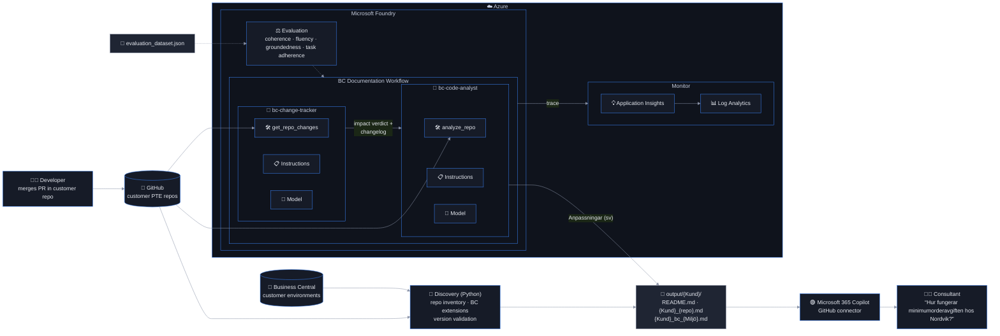

# 🧭 BC Deployment Analyzer

**Multi-agent documentation pipeline for Business Central Per-Tenant Extensions, built on Microsoft Foundry.**

A Microsoft partner maintains dozens of customer-specific Business Central extensions (PTEs) in GitHub.
Consultants who support those customers need to know *what each customisation does*, *which version is
live*, and *what changed last sprint* — but that knowledge lives in AL source code and in developers'
heads. Hand-written implementation documents go stale the day after they are written.

The BC Deployment Analyzer keeps that documentation alive automatically:



1. **Discovery** (deterministic Python) inventories the customer's GitHub repos and their live Business Central
   environments, and validates that the published extension version matches source control.
2. **`bc-change-tracker`** reads the pull requests merged since the last run and produces an impact verdict plus a
   Swedish changelog.
3. **`bc-code-analyst`** reads the AL source through a deterministic analysis tool and writes — or surgically
   updates — the Swedish *Anpassningar* documentation for each app.
4. The Markdown lands in GitHub, the **Microsoft 365 Copilot GitHub connector** indexes it, and consultants ask
   Copilot instead of reading code.

## The agents

| Agent | Responsibility | Tool (deterministic) | Output |
|---|---|---|---|
| **bc-change-tracker** | Explain what changed between two commits and how much of the documentation is affected | `get_repo_changes` — commits, merged PRs, AL patches, changed-object classification, version before/after | JSON verdict (`impact: none/minor/major`, `affected_features`, `requires_full_regeneration`) + Swedish changelog entry |
| **bc-code-analyst** | Describe what a PTE does for consultants, in Swedish, following the partner's documentation standard | `analyze_repo` — app.json, object inventory, codeunit archetypes (logic / subscribers / install), event subscribers, fields, page actions, API properties, source | `### App` → `#### Feature …` → `#### Övriga anpassningar` section; full or update mode |

**Why two agents instead of one?** They answer different questions on different data sizes. The tracker
works on a small diff and is optimised for precision about deltas; the analyst works on a whole repository and
is optimised for completeness. Splitting them lets the orchestrator *skip unchanged repos for free*, run the
cheap tracker on changed ones, and only pay for full regeneration when the change is major — and the tracker's
output doubles as a customer-facing change history. Details in [`agents/README.md`](./agents/README.md).

## Repository structure

| # | Phase | Folder | What it does |
|---|---|---|---|
| 0 | [Setup](./setup/README.md) | `setup/` | `deploy.sh` provisions a dedicated resource group: Foundry account + project + `gpt-5.4`, Log Analytics, Application Insights; writes `.env` |
| 1 | [Discovery](./discovery/README.md) | `discovery/` | `discover_repos.py` (GitHub inventory + app.json metadata), `discover_bc_extensions.py` (installed extensions, **version validation** report per BC environment) |
| 2 | [Build agents](./agents/README.md) | `agents/` | The two Foundry agents, their instruction files and FunctionTools |
| 3 | [Monitor](./monitoring/README.md) | `monitoring/` | GenAI tracing to Application Insights + business KPIs (`bc.*` span attributes) and ready-made KQL queries |
| 4 | [Evaluate](./evaluation/README.md) | `evaluation/` | Nine-case dataset, LLM-as-judge + deterministic evaluators, CI quality gate |
| 5 | [Orchestrate](./orchestration/README.md) | `orchestration/` | `run_pipeline.py` — SHA-based change detection, tracker → analyst flow, per-customer output; optional Foundry Workflow agent |
| – | Shared | `common/` | Config/.env loading, GitHub client, AL analysis, tracing helpers |
| – | Design | [`SOLUTION_DESIGN.md`](./SOLUTION_DESIGN.md) | Business problem, users, agent architecture, observability, evaluation, governance, end-to-end workflow |
| – | Examples | [`docs/examples/`](./docs/examples/) | What the generated documents look like |

## Quick start

```bash
git clone https://github.com/hannisky/BC-Deployment-Analyser.git && cd BC-Deployment-Analyser
python -m venv .venv && source .venv/bin/activate          # Windows: .venv\Scripts\activate
pip install -r requirements.txt
az login
bash setup/deploy.sh                                        # 0. provision Foundry + App Insights → .env
#    fill GITHUB_TOKEN and BC_* in .env, copy discovery/repos_config.example.json → repos_config.json
python discovery/discover_repos.py                          # 1a. GitHub inventory
python discovery/discover_bc_extensions.py                  # 1b. BC extensions + version validation report
python agents/agents.py --org <org> --repo <repo>           # 2. deploy agents, document one repo
python monitoring/monitor.py                                # 3. traced run → App Insights
python evaluation/evaluate.py                               # 4. quality scores + gate
python orchestration/run_pipeline.py                        # 5. document everything, then only what changed
```

Everything reads credentials as *environment variable → config file fallback*, so the same code runs locally
with `.env` and unattended in the included [GitHub Actions workflow](./.github/workflows/generate-docs.yml).

## What the output looks like

For each customer the pipeline maintains a folder that reads like the partner's hand-written implementation
document, but never goes stale:

- `README.md` — *Implementationsdokumentation {Kund}*: every app with version in Git, version in each BC
  environment (✅ / ⚠️ / ❓), link to its document and date last documented
- `{Kund}_{repo}.md` — *Anpassningar* for one app (`###` app, `####` per feature, `#### Övriga anpassningar`
  for event subscribers) followed by *Ändringshistorik* built from merged pull requests
- `{Kund}_bc_{Miljö}.md` — installed third-party extensions and the own-app version validation for one environment

See [`docs/examples/`](./docs/examples/) for rendered samples.

## Production readiness in one table

| Concern | How it is addressed |
|---|---|
| Grounding | Agents only see structured tool output; archetype rules, field lists and diffs are computed in Python, never guessed |
| Consistency | Instruction files are versioned in git; `create_version()` gives immutable agent versions; deterministic format checks in CI |
| Observability | `AIProjectInstrumentor` GenAI spans + `bc.pipeline.*` spans with cost/mode/impact per repo → App Insights / KQL |
| Quality | LLM-as-judge (coherence, fluency, groundedness, task adherence) + format/coverage evaluators, threshold gate, portal evaluations on traces |
| Cost control | SHA comparison skips unchanged repos; change tracker decides between cheap update and full regeneration; source budget per repo |
| Security | Read-only GitHub PAT on a bot account, partner-tenant app registration with GDAP, Entra ID for Foundry, dedicated resource group, secrets never in the repo |
| Safety | Foundry content filters on both agents; output is documentation reviewed by consultants, no write actions against customer systems |


