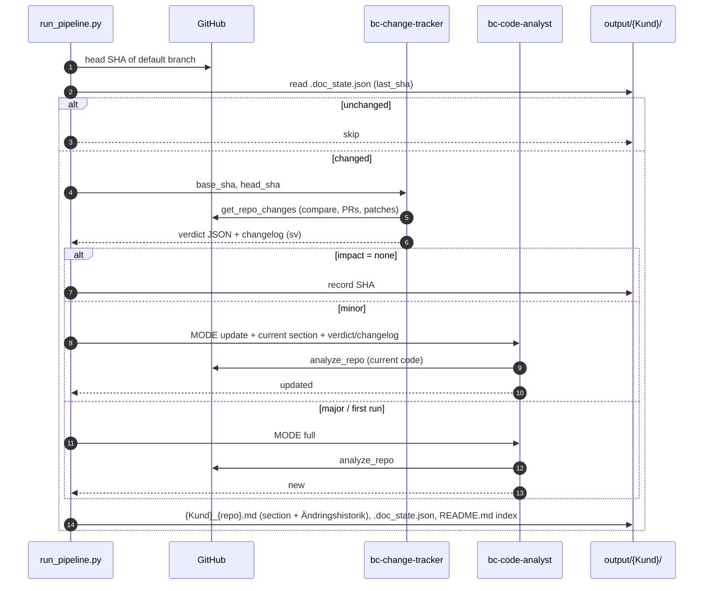

# Solution Design — BC Deployment Analyzer

*Production-ready multi-agent documentation for Business Central Per-Tenant Extensions on Microsoft Foundry.*

This document follows the three steps of the course assignment: **design**, **production-readiness plan**,
**end-to-end workflow**. Diagrams are Mermaid; the code referenced lives in this repository.

---

## Step 1 — Solution design

### 1.1 Business problem

A Microsoft Dynamics 365 Business Central partner develops and operates customer-specific extensions
(Per-Tenant Extensions, PTEs). Each customer has 3–10 GitHub repositories of AL code and one or more
Business Central environments. Today:

- **Knowledge is locked in code.** Only the developer who wrote a codeunit knows what it does. Support
  consultants either read AL or ask around.
- **Documentation decays.** The partner's hand-written *Implementationsdokumentation* (installed extensions,
  process descriptions, customisations) is accurate on the day it is written; a real example was missing an
  entire feature (`CustomCreditLimitMgt`) that existed in the repository.
- **Nobody knows what is live.** Whether the version in `main` is the version installed in the customer's
  production environment is checked manually, if at all — a source of surprises during upgrades.
- **Change history is invisible to non-developers.** Merged pull requests explain *why* something changed,
  but consultants never see them.

### 1.2 Intended users

| User | Needs | Touchpoint |
|---|---|---|
| **Support / application consultants** | "How does the minimum order fee work at Nordvik?", "Which apps does customer X have and are they up to date?" | Microsoft 365 Copilot chat (GitHub connector indexes the generated Markdown), or the Markdown directly |
| **Project managers / customer leads** | Release notes per customer per sprint in plain Swedish | *Ändringshistorik* section per app, *Senaste ändringar* on the customer index |
| **Developers** | Zero extra work; a safety net that flags unpublished versions and undocumented objects | Nothing to do — merging a PR triggers the update |
| **Operations (partner IT)** | Cost, failures and quality of the pipeline | Application Insights dashboards, evaluation reports |

### 1.3 Agents

| | `bc-change-tracker` | `bc-code-analyst` |
|---|---|---|
| **Responsibility** | Explain what changed in a repository between two commits; rate documentation impact | Describe what an AL app does for consultants, in Swedish, following the partner's documentation standard |
| **Tool** | `get_repo_changes(org, repo, base_sha, head_sha)` | `analyze_repo(org, repo, branch)` |
| **Knowledge source** | GitHub compare API, merged PR titles/bodies, AL patches, app.json versions | GitHub tree/contents, `app.json`, all `.al` files, deterministic archetype classification |
| **Output contract** | JSON verdict (`impact`, `affected_features`, `new_objects`, `requires_full_regeneration`, `summary_sv`) + Swedish changelog | `### App` → `#### Feature (AL object)` → `#### Övriga anpassningar`; full or update mode |
| **Instructions** | `agents/instructions/change_tracker.md` | `agents/instructions/code_analyst.md` |

Both are `PromptAgentDefinition` agents created with `create_version()`, versioned and reusable by name.

### 1.4 Tools, data sources and knowledge

| Component | Type | Used by | Grounding role |
|---|---|---|---|
| `common/al_analysis.py` | Deterministic parser | `analyze_repo` | Object types, fields, actions, API properties, `[EventSubscriber]`s, codeunit archetypes (logic / subscribers / install-upgrade), commented-out detection |
| GitHub REST API (read-only PAT) | Data source | both tools, discovery | Source of truth for code and history |
| Business Central Automation API | Data source | `discover_bc_extensions.py` | Installed extensions and versions per environment |
| `discovery/repos_config.json` | Inventory | discovery, orchestrator | Which repos belong to which customer, app metadata |
| `output/{Kund}/.doc_state.json` | State | orchestrator | Last documented SHA/version per repo → incremental runs |
| `known_extensions.json` (optional) | Curated lookup | BC report | Descriptions/links for third-party ISV apps |
| `agents/instructions/*.md` | Governance | agents | Format standard derived from the partner's reference document |

Deliberately **no vector store / RAG** in v1: the ground truth is always the current code, which fits
in context per repository. A knowledge base of past documents would risk describing removed features.

### 1.5 Why multi-agent

1. **Different questions, different data.** The tracker reasons about a small diff and must be precise about
   deltas; the analyst reasons about a whole repository and must be complete. One prompt doing both degrades both.
2. **Cost and latency.** The orchestrator skips unchanged repos with a SHA compare (zero LLM cost), runs the
   cheap tracker on changed repos, and regenerates fully only on `major` impact. A single-agent design would
   re-read every repository every night.
3. **Separate evaluation.** Verdict accuracy (`impact` correct?) and documentation quality (grounded, Swedish,
   well-structured?) are measured with different datasets and metrics; regressions are attributable.
4. **A second deliverable for free.** The tracker's changelog *is* the customer release note.
5. **Independent evolution.** The tracker can later gain a Jira/DevOps tool; the analyst can gain a
   terminology glossary — without touching the other.

### 1.6 Information flow

---

## Step 2 — Production-readiness plan

### 2.1 Observability strategy

**Traces collected** (OpenTelemetry → Application Insights, `common/tracing.py`):

| Span | Attributes | Purpose |
|---|---|---|
| GenAI spans (automatic, `AIProjectInstrumentor`) | model, input/output tokens, latency, prompt & completion content, tool call name/args/result, content-filter results | Debug exactly what the model saw and said; tool failures |
| `bc.pipeline.run` | `bc.repos`, `bc.documented`, `bc.updated`, `bc.skipped`, `bc.failed`, `bc.tokens_in/out`, `bc.duration_s` | Health of the nightly run; alert on `bc.failed > 0` |
| `bc.pipeline.customer` | `bc.customer`, `bc.repos`, `bc.failed` | Per-customer roll-up |
| `bc.pipeline.repo` | `bc.repo`, `bc.mode` (full/update/skip/no_app), `bc.impact`, `bc.pull_requests`, `bc.tokens_*`, `bc.duration_s`, `bc.section_chars` | Cost per repo, mode distribution, slow repos |
| `bc.agent.change_tracker` / `bc.agent.code_analyst` | `bc.repo`, `bc.mode` | Attribute latency to the right agent |

**Metrics / KQL** (`monitoring/queries.kql`): runs over time, token cost per customer, mode distribution
(efficiency of change detection), impact verdict distribution, slowest repos, per-agent p50/p95 latency and
error counts, tool call health, failure alert.

**How insights are used:** a wrong document → open the repo's trace → the `analyze_repo` span shows whether the
object existed (hallucination → fix instructions + add eval case) or the source was truncated (raise
`MAX_AL_CHARS`). Rising `update`/`full` ratio → developers merging often; rising tokens per repo → repos growing,
consider splitting. p95 latency spikes → model/deployment capacity.

### 2.2 Evaluation strategy

**Dataset** — `evaluation/evaluation_dataset.json`: nine synthetic-but-realistic cases for a fictional
customer, each containing the exact tool output the agent would receive (so runs are reproducible and need no
GitHub access) plus expectations: `must_mention` facts, `required_headings`, `forbidden` phrases, expected
`impact`, and a Swedish reference answer. Cases cover every archetype rule (logic codeunit, subscribers →
*Övriga anpassningar*, install skipped, commented-out → "ej implementerad", processing report, API page,
update mode) and the three impact classes. New cases are added whenever a real repository produces a bad
document; the portal can also convert production traces into datasets.

**Criteria**

| Metric | Type | Why |
|---|---|---|
| Groundedness | LLM judge, context = tool JSON | The #1 risk: fluent invention of features |
| Task adherence | LLM judge | Did it follow the archetype/format instructions? |
| Coherence | LLM judge | One feature per section, no contradictions |
| Fluency | LLM judge | Professional Swedish |
| Format adherence | deterministic | `###`/`####` structure, JSON verdict, forbidden phrases, Swedish markers — runs free in CI |
| Coverage | deterministic | Required facts (fields, actions, PR numbers) present |
| Verdict accuracy | deterministic | `impact` and `requires_full_regeneration` match expectations |

Tool Call Accuracy is intentionally not used in the portal (tools cannot run there).

**Lifecycle integration**

1. *Pre-merge*: GitHub Actions runs `evaluate.py --offline --no-llm-judge` (deterministic) on every PR; PRs that
   touch `agents/instructions/` or `common/al_analysis.py` additionally run the full LLM-judged evaluation with a
   3.5 threshold gate.
2. *Pre-release*: `agents.py --recreate` publishes a new agent version only after the gate passes; old versions
   stay in Foundry for rollback.
3. *In production*: weekly scheduled portal evaluation on the agents' traces (Foundry → Agent → Monitor);
   scores trend next to cost and latency.
4. *Feedback loop*: consultant flags a document → case added → fix → re-evaluate.

### 2.3 Governance and reliability

- **Consistent outputs**: the *format* is enforced by instructions versioned in git and verified by deterministic
  evaluators; the *content* is bounded by tool output. The orchestrator assembles the final document itself
  (header, section between marker comments, change history), so agents never touch metadata or history.
- **Grounding**: agents cannot document what `analyze_repo` did not find. Archetype classification (which files
  become sections, which are skipped) is code, not model judgement. Version validation against Business Central
  is fully deterministic and lives outside the agents.
- **Safe behaviour**: Foundry content filters on both agents; the pipeline only *reads* GitHub and BC and only
  *writes* Markdown to its own repository; a human still reviews documents before they are handed to customers.
  Message-content capture in traces means App Insights holds customer code — dedicated resource group, restricted
  readers, retention policy.
- **Maintainability**: five folders mirror the lifecycle (setup, discovery, agents, monitoring, evaluation,
  orchestration); credentials are env-var-first with file fallback; instruction files are Markdown; agent
  versions are immutable; `.doc_state.json` makes every run idempotent and resumable.
- **Least privilege**: bot GitHub account with read-only fine-grained PAT; one partner-tenant app registration
  using GDAP for BC; Entra ID (`DefaultAzureCredential`) for Foundry, no API keys; GitHub Actions uses OIDC.
- **Failure handling**: per-repo try/except with continue; failures counted, printed and traced; exit code 1
  for the scheduler; unchanged documents are never overwritten with worse ones (an agent response that does not
  start with `###` is rejected).

---

## Step 3 — End-to-end workflow

### 3.1 Sequence

1. **Trigger** — nightly GitHub Actions schedule (or manual dispatch / PR-merge webhook later).
2. **Discovery** — `discover_repos.py` refreshes the customer inventory with `app.json` metadata and head SHAs;
   `discover_bc_extensions.py` queries each BC environment and writes the *Installerade tillägg* report with
   ✅/⚠️/❓ version validation.
3. **Change detection** — per repo, head SHA vs. `.doc_state.json`.
4. **`bc-change-tracker`** — `get_repo_changes` → verdict + Swedish changelog.
5. **`bc-code-analyst`** — `analyze_repo` → full or updated *Anpassningar* section.
6. **Assembly** — document per app, change history prepended, customer index regenerated with Git vs. BC versions.
7. **Publish** — commit to the docs repository → Microsoft 365 Copilot GitHub connector indexes → consultants ask Copilot.
8. **Observe / evaluate / improve** — traces and KPIs in App Insights; scheduled evaluations; dataset grows from feedback.

### 3.2 Information passed

| From → To | Payload |
|---|---|
| Discovery → orchestrator | `repos_config.json` (repos, app id/name/version, head SHA), BC reports (versions, statuses) |
| Orchestrator → tracker | `org, repo, base_sha, head_sha` |
| Tracker → orchestrator | verdict JSON, changelog Markdown |
| Orchestrator → analyst | mode, `org/repo/branch`, (update) current section + verdict + changelog |
| Analyst → orchestrator | `###` section |
| Orchestrator → files | app document, `.doc_state.json`, customer `README.md` |
| Files → Copilot | Markdown indexed by the GitHub connector |

### 3.3 Final output

Per customer: an index page (*Implementationsdokumentation {Kund}*), one document per app (*Anpassningar* +
*Ändringshistorik*), one report per BC environment (*Installerade tillägg* + version validation). Consultants
consume it through Copilot chat: *"Vilka anpassningar har Nordvik på inköpsorder och när ändrades de senast?"*

### 3.4 Deployment, monitoring, evaluation, improvement over time

| Aspect | v1 (this repo) | Next |
|---|---|---|
| Deployment | GitHub Actions nightly (`generate-docs.yml`), Azure OIDC, secrets in GitHub | PR-merge webhook → Azure Function documenting just that repo within minutes |
| Monitoring | App Insights traces + `bc.*` KPIs + KQL, failure alert | Azure Monitor workbook per customer; budget alert on tokens |
| Evaluation | 9-case dataset, judge + deterministic gate, portal evaluations | Dataset built from production traces; consultant thumbs-up/down feeding new cases |
| Documentation scope | Section 3 *Anpassningar* + Section 1 extension inventory | Section 2 *Flödesbeskrivning* from a curated knowledge base of process descriptions; internal/shared repos; `custom_label` glossary |
| Agents | 2 | Optional *reviewer* agent scoring each section before publish (LLM-as-judge inline), Jira/DevOps tool for the tracker |

---

## Appendix — mapping to course concepts

| Course concept | Where it shows up |
|---|---|
| Specialised agents with tools | `agents/agents.py`, `agents/tools.py` |
| Knowledge sources & grounding | Deterministic AL analysis, GitHub/BC APIs, instruction files |
| Tracing & monitoring | `common/tracing.py`, `monitoring/` |
| Evaluation with datasets & metrics | `evaluation/` |
| Orchestration into workflows | `orchestration/run_pipeline.py`, `create_workflow_agent.py` |
| Prototype → production | POC (`Git-Knowledge-Connector`) → this repository |
