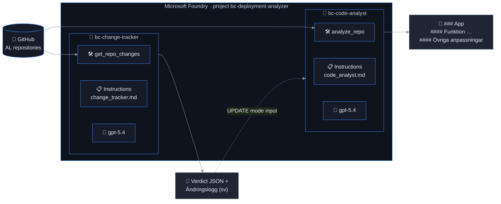

# Build Agents: `bc-code-analyst` and `bc-change-tracker`

Time: ~30 minutes

## Objectives

- ✅ A **Code Analyst agent** that turns AL source into Swedish consultant documentation ("Anpassningar")
- ✅ A **Change Tracker agent** that explains what changed since the last documentation run and rates the impact
- ✅ Both grounded by deterministic FunctionTools, versioned in Foundry, and reusable by name



## Why two agents?

| | `bc-code-analyst` | `bc-change-tracker` |
|---|---|---|
| Question it answers | *What does this app do, today?* | *What changed since we last documented it, and does it matter?* |
| Tool | `analyze_repo` — whole-repo analysis (manifest, object inventory, archetypes, subscribers, source) | `get_repo_changes` — commits, merged PRs, patches, changed-object classification, version before/after |
| Input size | Large (a whole PTE) | Small (a diff) |
| Output | Swedish `###`/`####` documentation section | JSON verdict (`impact`, `affected_features`, `requires_full_regeneration`) + Swedish changelog |
| Optimised for | Completeness and faithful description | Precision about deltas, reading PR intent |

A single agent that both reads diffs and rewrites whole documents would need one prompt to do two
contradictory jobs (be exhaustive vs. be surgical) and would re-read every repository on every run.
Splitting them lets the pipeline **skip unchanged repos entirely**, run the cheap change tracker on
changed ones, and only pay for full regeneration when the tracker says the change is `major`. The
tracker's output also becomes the customer-facing **Ändringshistorik** — a deliverable in its own right.

## Tools are code, agents are prose

Both tools live in [`tools.py`](./tools.py) and follow the lab's `check_thresholds` pattern — everything
decidable by rules is decided in Python, the model only phrases the result:

- `common/al_analysis.py` parses every `.al` file: object type/id/name, table fields, page actions and
  API properties, procedures, `[EventSubscriber]` attributes, and classifies codeunits into the three
  archetypes from the documentation spec (**logic → own `####` section**, **subscribers → "Övriga
  anpassningar"**, **install/upgrade → skipped**). Commented-out bodies are detected so the agent can
  write *"Fungerar ej då logiken ej är implementerad"*.
- `get_repo_changes` uses the GitHub compare API plus merged-PR lookup, filters out documentation-irrelevant
  files (`.github/`, XLIFF, README), truncates patches to a budget and re-classifies each changed AL object at head.

The agents therefore cannot document an object that does not exist — a groundedness property you can
verify with the evaluators in `evaluation/`.

## Instructions

The system prompts are plain Markdown files so consultants can review and version them:

- [`instructions/code_analyst.md`](./instructions/code_analyst.md) — Swedish format rules ported from the
  original documentation spec (H3 per app, H4 per feature, "Övriga anpassningar" last, prose not bullets),
  plus an **update mode** that integrates a change summary into an existing section while keeping unchanged text.
- [`instructions/change_tracker.md`](./instructions/change_tracker.md) — the JSON verdict contract and the
  changelog layout (**Nya funktioner / Ändringar / Borttaget / Tekniskt**).

Edit a file, then `python agents/agents.py --recreate` to publish a new agent version. Old versions remain
in Foundry for rollback.

## Run it

```bash
python agents/agents.py --org <org> --repo <repo>                 # document one repository
python agents/agents.py --org <org> --repo <repo> --since <sha>   # + changelog since a commit
python agents/tools.py analyze_repo --org <org> --repo <repo>      # inspect the tool output alone (no LLM)
```

Watch the terminal: you will see `🛠 bc-code-analyst → analyze_repo(...)` when the model decides to call the
tool, the function-call loop feeding the result back, and finally the Swedish section. Both agents then
appear in the [Foundry portal](https://ai.azure.com/nextgen) under **Build → Agents**, where you can test
them interactively — paste an analysis JSON to run without tool access.

## Success criteria

- [ ] Both agents visible in the portal with the `solution: bc-deployment-analyzer` metadata
- [ ] The analyst output starts with `### <app name>`, has `####` features, Swedish prose, no install codeunits
- [ ] The tracker output starts with a ```` ```json ```` verdict block followed by a `####` changelog entry
