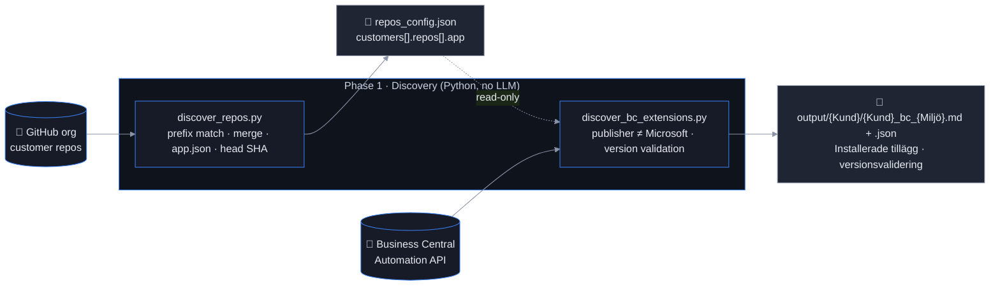

# Discovery: Inventory GitHub repositories and Business Central environments

Time: ~5 minutes per customer

Discovery is **deterministic** — no agents, no LLM. It produces the verified facts the rest of the
pipeline builds on: which repositories belong to a customer, which AL app each one contains, and which
extensions are actually installed in the customer's Business Central environment.



## 1. `discover_repos.py` — GitHub inventory

1. Lists all repositories in the customer's GitHub org
2. Keeps those whose name starts with `search_prefix` **case-insensitively** — real naming is inconsistent
   (`Acme_CRM_Integration`, `Acme-PTE`, `AcmeSC-PTE`)
3. Merges into `repos[]`: new repos are added, vanished repos get `active: false` (soft delete), archived repos are inactive
4. **New compared to the POC:** reads each repo's `app.json` (wherever it is in the tree) and stores
   `app.id / name / publisher / version`, the default-branch `head_sha` and the AL file count

```bash
python discovery/discover_repos.py                        # all enabled customers
python discovery/discover_repos.py --customer "Acme AB"   # one customer
python discovery/discover_repos.py --skip-app-metadata    # names only (fast)
```

### `repos_config.json`

Copy `repos_config.example.json` → `repos_config.json` (gitignored) and add your customers:

```json
{
  "customers": [
    {
      "name": "Acme AB",
      "search_prefix": "acme",
      "org": "your-github-org",
      "enabled": true,
      "bc_environments": [
        { "tenant_id": "<customer tenant guid>", "environment": "Production", "company_name": "Acme AB" },
        { "tenant_id": "<customer tenant guid>", "environment": "Sandbox",    "company_name": "Acme AB" }
      ],
      "repos": []
    }
  ]
}
```

| Field | Meaning |
|---|---|
| `search_prefix` | Case-insensitive prefix filter on repo names |
| `org` | GitHub organisation (falls back to a user account with the same name) |
| `enabled` | `false` skips the customer everywhere without deleting the entry |
| `bc_environments[]` | One entry per BC environment to inventory (each gets its own report) |
| `repos[].custom_label` | Optional display name override for the generated documentation |
| `repos[].app` | Filled by the script from `app.json` — the key the BC comparison and the customer index use |

## 2. `discover_bc_extensions.py` — Business Central inventory + version validation

Runs **in isolation**: it reads `repos_config.json` but never writes to it, and produces its own files
per environment. For each `bc_environments[]` entry it:

1. Acquires a token for the **customer tenant** with the partner-tenant app registration (client credentials, GDAP)
2. Resolves any company id (apps are installed environment-wide) and calls
   `…/companies({id})/extensions?$filter=publisher ne 'Microsoft'`
3. Tags each extension as **third-party ISV** or **own-published** (`BC_OWN_PUBLISHER`)
4. Matches own-published apps to repos — by **app id** first, then by normalised name — and compares versions
   on `major.minor.build`
5. Writes `output/{Kund}/{Kund}_bc_{Miljö}.json` and a Swedish Markdown report `…_bc_{Miljö}.md`

```bash
python discovery/discover_bc_extensions.py --customer "Acme AB"
```

### The report replaces manual placeholders with a validation

| Status | Meaning |
|---|---|
| ✅ Matchar | `app.json` version equals the published version |
| ⚠️ Git är nyare – ej publicerad ändring | Source has moved on; the environment runs an older build |
| ⚠️ BC är nyare – källkod saknar publicerad version | A build is installed that is not in the default branch (hotfix branch? unpushed?) |
| ❓ Inget repo hittades | Own-published app without a matching repo — renamed or unpublished |
| ❔ Ej publicerad i miljön | Repo with `app.json` that is not installed in this environment |

Third-party extensions are listed with publisher/version; descriptions and "Mer information" links come
from the optional `known_extensions.json` lookup (copy the `.example.json`).

### Authentication

| Service | Method | Notes |
|---|---|---|
| GitHub | Fine-grained PAT, dedicated bot account | `GITHUB_TOKEN`; Contents/Metadata/Pull requests read-only |
| Business Central | Azure AD app in the partner tenant, client credentials | `BC_CLIENT_ID`/`BC_CLIENT_SECRET` (or `discovery/bc_config.json`); the *customer* tenant id goes into `bc_environments[]`; requires a GDAP role covering the BC Automation API |

## Success criteria

- [ ] `repos_config.json` lists every customer repo with `app.name` and `app.version` filled in
- [ ] `output/<Kund>/<Kund>_bc_Production.md` exists with a summary table and per-app version status
- [ ] Version mismatches you know about show up as ⚠️
