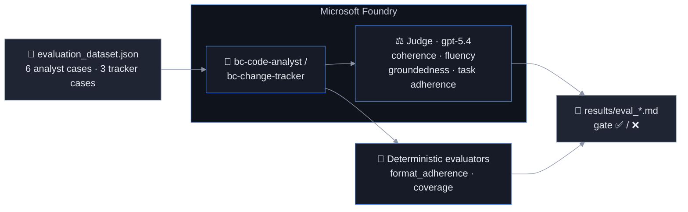

# Evaluate: Is the generated documentation actually good?

Time: ~30 minutes

## Objectives

- ✅ A reusable evaluation dataset that mirrors real PTE patterns
- ✅ LLM-as-judge scores (coherence, fluency, groundedness, task adherence) plus deterministic format checks
- ✅ A quality gate that fails CI when a prompt or model change degrades output



## Why evaluate a documentation generator?

Monitoring tells you the pipeline *ran*. Evaluation tells you whether a consultant can *trust* the
output. Failure modes specific to this solution:

- **Hallucinated features** — a fluent Swedish paragraph about a setup page that does not exist. Caught by
  **groundedness** (context = the analysis JSON) and **coverage/format** checks.
- **Format drift** — a model update starts emitting bullet lists, English, or a changelog inside the
  section. Caught by **format_adherence** (deterministic, free, runs in CI without Azure).
- **Wrong impact verdicts** — the tracker calls a new codeunit `minor`, so the pipeline patches instead of
  regenerating. Caught by the tracker cases (`impact`, `requires_full_regeneration` must match).
- **Skipped archetype rules** — install codeunits documented, subscribers not collapsed. Caught by
  `forbidden` and `required_headings` checks.

## The dataset

[`evaluation_dataset.json`](./evaluation_dataset.json) contains nine cases for a fictional customer
(*Nordvik Industri AB*). Each carries the exact tool output the agent would have received, so evaluation
runs **without GitHub access** and is fully reproducible:

| Case | Agent | Tests |
|---|---|---|
| CA-01 | code_analyst | Logic codeunit + setup table/page + release trigger → own `####` section |
| CA-02 | code_analyst | Subscriber-only codeunit + install codeunit → "Övriga anpassningar", install skipped |
| CA-03 | code_analyst | Commented-out codeunit → "Fungerar ej då logiken ej är implementerad" |
| CA-04 | code_analyst | Processing-only report triggered from a page action |
| CA-05 | code_analyst | API page properties, table extension, setup page, dependency |
| CA-06 | code_analyst | **Update mode**: integrate a new feature, keep unchanged text, no changelog |
| CT-01 | change_tracker | Minor change via one PR → `minor`, no full regeneration |
| CT-02 | change_tracker | New codeunit + dependency → `major`, full regeneration |
| CT-03 | change_tracker | Version bump + pipeline files only → `none` |

Each `expected` block holds `must_mention` facts, `required_headings`, `forbidden` phrases and a Swedish
reference answer (`reference_response_sv`) used as ground truth in the portal. Add a case whenever a real
repository produces a bad document — that is how the dataset grows with the product.

## Evaluators

| Evaluator | Type | What a low score means |
|---|---|---|
| `coherence` | LLM judge | The section contradicts itself or jumps between features |
| `fluency` | LLM judge | Broken Swedish, awkward phrasing |
| `groundedness` | LLM judge | Claims not supported by the analysis/change data |
| `task_adherence` | LLM judge | Ignored instructions (e.g. documented install codeunits, wrote English) |
| `format_adherence` | deterministic | Heading structure, forbidden phrases, JSON verdict, Swedish markers |
| `coverage` | deterministic | Share of expected facts (fields, actions, PR numbers) present |

The judge uses the same `gpt-5.4` deployment via the Foundry account endpoint, authenticated with
`DefaultAzureCredential` (or `AZURE_OPENAI_API_KEY` if set).

## Run it

```bash
python evaluation/evaluate.py                        # all cases, live agents + judge
python evaluation/evaluate.py --agent code_analyst --verbose
python evaluation/evaluate.py --offline --no-llm-judge   # deterministic checks on the reference answers (CI smoke test, no Azure)
python evaluation/evaluate.py --threshold 4.0        # stricter gate
python evaluation/evaluate.py --export-portal        # writes eval_portal.jsonl
```

Results land in `evaluation/results/eval_<timestamp>.md` (+ `.json`, `latest.md`) with aggregate means and a
per-case table listing failed checks and missing facts. Exit code 1 when any metric mean is below the
threshold — wire it into CI:

```yaml
- run: python evaluation/evaluate.py --threshold 3.5     # blocks the PR that changes agents/instructions/*.md
```

### Portal alternative

`eval_portal.jsonl` (query / context / ground_truth) can be uploaded in the Foundry portal:
**Build → Evaluations → Create → Agent → bc-code-analyst → Individual turns → upload dataset**, keep
Coherence, Fluency, Groundedness; deselect Tool Call Accuracy (tools are not executed there). Results appear
next to the agent's traces and can be scheduled.

## Lifecycle

1. **Before deploying a new agent version** (`agents.py --recreate`): run the full evaluation, compare with `results/latest.md`
2. **On every PR** touching `agents/instructions/` or `common/al_analysis.py`: the deterministic gate runs in GitHub Actions
3. **Weekly**: scheduled portal evaluation on production traces (Foundry → Agent → Monitor → Scheduled evaluations)
4. **Whenever a consultant flags a bad document**: add the repo's analysis as a new case, fix, re-run

## Success criteria

- [ ] `--offline --no-llm-judge` passes with `format_adherence` ≥ 4.5 and `coverage` = 5.0
- [ ] Live run: all four LLM metrics ≥ 3.5, results file written
- [ ] You can name the case that would catch a documented install codeunit (CA-02)
