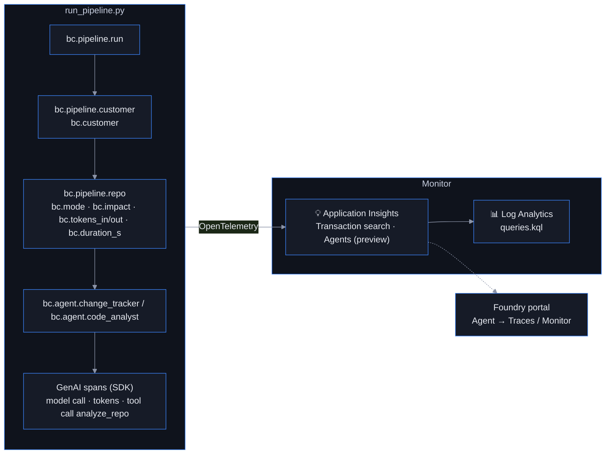

# Monitor: GenAI tracing and pipeline KPIs in Application Insights

Time: ~20 minutes

## Objectives

- ✅ Every agent run, model call and tool call captured as a distributed trace
- ✅ Business KPIs (per customer / repo: mode, impact, tokens, duration) queryable in Log Analytics
- ✅ A place to look when a generated document is wrong



## What is traced and why

| Signal | Source | Question it answers |
|---|---|---|
| Model calls: latency, input/output tokens, errors, content filter hits | `AIProjectInstrumentor` (automatic) | Is the model slow or failing? What did it actually see and say? |
| Tool calls `analyze_repo` / `get_repo_changes` with inputs & outputs | `AIProjectInstrumentor` (automatic) | Did the agent get the right data? Did GitHub time out? |
| `bc.pipeline.repo` span with `bc.mode` (full/update/skip), `bc.impact`, `bc.tokens_*`, `bc.duration_s` | `common/tracing.py` (ours) | Cost per customer, share of skipped repos, slow repos |
| `bc.pipeline.run` span with documented/updated/skipped/failed counts | `common/tracing.py` (ours) | Did tonight's run succeed? Alert if `bc.failed > 0` |

The custom attributes carry the `bc.` prefix and land in `customDimensions`, so a single Kusto query
answers "how many tokens did customer X cost last month" — see [`queries.kql`](./queries.kql) for eight
ready-made queries (runs, cost per customer, mode distribution, impact verdicts, slow repos, per-agent
GenAI stats, tool health, failure alert).

## Prerequisites

`.env` must contain (written by `setup/deploy.sh`):

```
APPLICATIONINSIGHTS_CONNECTION_STRING=InstrumentationKey=...
AZURE_EXPERIMENTAL_ENABLE_GENAI_TRACING=true
OTEL_INSTRUMENTATION_GENAI_CAPTURE_MESSAGE_CONTENT=true
```

`OTEL_INSTRUMENTATION_GENAI_CAPTURE_MESSAGE_CONTENT=true` stores prompts and completions in the trace —
including customer AL source. That is what makes debugging possible, but treat the App Insights resource
as customer-confidential (dedicated resource group, restricted readers, default 90-day retention).

## Run it

```bash
python monitoring/monitor.py                         # traced run on a bundled sample analysis (no GitHub needed)
python monitoring/monitor.py --org <org> --repo <r>  # traced run against a real repository
```

`monitor.py` enables tracing **before** the Foundry SDK is imported (the order matters), reuses
`bc-code-analyst`, wraps the call in the same `bc.pipeline.*` spans the orchestrator uses, and flushes.
The orchestrator (`orchestration/run_pipeline.py`) turns tracing on automatically whenever the connection
string is present — pass `--no-trace` to opt out.

## Where to look

1. **Foundry portal** → project → **Agents → bc-code-analyst → Traces**: one row per run with tokens,
   duration and estimated cost; open a row to see the tool call span with the analysis JSON that the model
   received and the Swedish section it produced. **Monitor** shows runs and token trends per agent.
2. **Azure portal → Application Insights → Investigate → Transaction search**: search `bc.pipeline.repo`
   to see the end-to-end trace for one repository — tracker → analyst → model calls.
3. **Investigate → Agents (preview)**: per-agent run counts, GenAI errors, tool call table, tokens by model.
4. **Logs**: paste queries from `queries.kql`.

### Diagnosing a bad document

A consultant reports that the documentation for `Acme-PTE` describes a feature that does not exist.
Open the latest `bc.pipeline.repo` trace for that repo: the `analyze_repo` span shows exactly which
objects the tool found; if the object is absent there, the model hallucinated → tighten the instructions
and add the case to `evaluation/evaluation_dataset.json`. If the object *is* there but misdescribed,
the source was probably truncated (`source_omitted_for_budget`) → raise `MAX_AL_CHARS` or split the repo.

## Success criteria

- [ ] `monitor.py` completes and prints the flush message
- [ ] The run appears under the agent's **Traces** tab in the Foundry portal
- [ ] Query 1 in `queries.kql` returns a row for the run with `bc.tokens_in` populated
