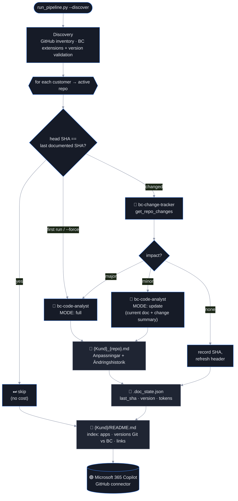

# Orchestrate: The production pipeline

Time: ~20 minutes to run, then it runs itself

## Objectives

- ✅ Persistent agents reused by name — created once, versioned, never re-created per run
- ✅ A pipeline that documents new repositories, **updates only what changed**, and skips the rest
- ✅ Per-customer output that a Microsoft 365 Copilot GitHub connector can index



## Information flow between the agents

1. The orchestrator compares the repository's **head SHA** with the SHA stored in `.doc_state.json`.
2. If it changed, `bc-change-tracker` calls `get_repo_changes(base_sha, head_sha)` and returns
   a **JSON verdict** (`impact`, `affected_features`, `requires_full_regeneration`, `summary_sv`) and a
   **Swedish changelog entry**.
3. The verdict decides the analyst's mode. In **update** mode the analyst receives the *current section* and
   the *change summary*, calls `analyze_repo` for the current code, and returns the full updated section while
   keeping unchanged paragraphs — the customer's documentation diff stays small.
4. The orchestrator assembles the document deterministically: metadata header, the agent's `###` section
   between marker comments, and the **Ändringshistoria** with the tracker's entry prepended. Text outside the
   markers (manual notes) is preserved.
5. The customer index cross-references the BC environment reports from discovery, so one page shows
   *documented version*, *version in Git* and *version in each BC environment*.

## Run it

```bash
python orchestration/run_pipeline.py --dry-run                 # which repos would be documented/updated/skipped?
python orchestration/run_pipeline.py --discover                # discovery + documentation for all customers
python orchestration/run_pipeline.py --customer "Acme AB"      # one customer
python orchestration/run_pipeline.py --repo Acme-PTE --force   # regenerate one repository
python orchestration/run_pipeline.py --recreate-agents         # after editing agents/instructions/*.md
```

Expected output:

```
=== Agents ===
  ↺ Reusing existing agent bc-code-analyst
  ↺ Reusing existing agent bc-change-tracker

[CUSTOMER] Acme AB → output/Acme_AB
  [SKIP  ] Acme-API-PTE @ 3f9c2a1 (v28.0.0.0) — last documented 3f9c2a1
  [UPDATE] Acme-PTE @ b71e0d4 (v28.1.0.0) — last documented 3f9c2a1
    🛠  bc-change-tracker → get_repo_changes(org=acme-org, repo=Acme-PTE, base_sha=3f9c2a1e5b, head_sha=b71e0d4c2a)
    → impact=minor full_regen=False features=['Kontraktsfält']
    🛠  bc-code-analyst → analyze_repo(org=acme-org, repo=Acme-PTE, branch=main)
    ✅ wrote Acme_AB_Acme-PTE.md (6 412 chars, 41 230/1 980 tokens, 48.2s)
  [FULL  ] Acme-New-PTE @ 0a1b2c3 (v1.0.0.0)
    ...
  📄 index → output/Acme_AB/README.md

BC DEPLOYMENT ANALYZER — RUN SUMMARY
  repos=3 documented=1 updated=1 skipped=1 no_app=0 failed=0 tokens_in=79 812 tokens_out=4 105
```

## Output layout

```
output/
└── Acme_AB/
    ├── README.md                      # index: apps, versions (Git vs BC), links, latest changes
    ├── Acme_AB_Acme-PTE.md            # one document per PTE app
    ├── Acme_AB_Acme-API-PTE.md
    ├── Acme_AB_bc_Production.md       # from discovery: installed extensions + version validation
    ├── Acme_AB_bc_Production.json
    └── .doc_state.json                # last documented SHA / version / cost per repo
```

File names carry the customer name so a flattened search index (Copilot, SharePoint, GitHub search) can
still tell whose document it is.

## Deploying it

| Option | How | When |
|---|---|---|
| **GitHub Actions** (included) | [`.github/workflows/generate-docs.yml`](../.github/workflows/generate-docs.yml) — nightly schedule + manual dispatch, Azure OIDC login, commits `output/` back so the Copilot connector indexes it | Default choice — no servers, secrets in GitHub |
| Windows VM scheduled task | `python orchestration/run_pipeline.py --discover` with `.env` on the machine | When BC/GitHub access must originate from a partner IP |
| Azure Functions / Container Apps job | Wrap `main()`; timer trigger; Key Vault for secrets | When the number of customers outgrows a single job |
| **Foundry Workflow agent** | `python orchestration/create_workflow_agent.py` registers tracker → analyst as a portal workflow | Portal visibility and traces; cannot execute local tools, so paste analysis JSON |

## Success criteria

- [ ] `--dry-run` lists every active repo with a mode
- [ ] A second run right after the first shows only `[SKIP]` lines and zero tokens
- [ ] After merging a PR in a customer repo, the next run shows `[UPDATE]`, and the app document gains a new `####` entry under *Ändringshistorik*
- [ ] `output/<Kund>/README.md` shows versions from both Git and the BC environment report
