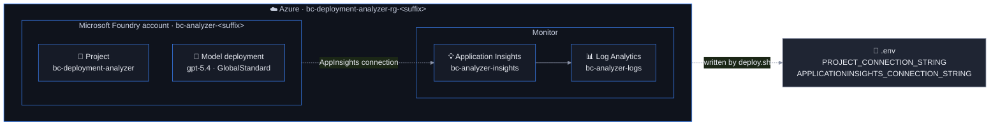

# Setup: Provision Microsoft Foundry for the BC Deployment Analyzer

Time: ~20 minutes (most of it waiting for Azure)

## What you get

`deploy.sh` provisions a **dedicated resource group** so the analyzer's cost and access can be
managed separately from other Foundry workloads:



| Resource | Purpose |
|---|---|
| Foundry account (`AIServices`) + project | Hosts the two agents (`bc-code-analyst`, `bc-change-tracker`), evaluations and traces |
| Model deployment `gpt-5.4` | Used by both agents and as the evaluation judge |
| Log Analytics + Application Insights | Destination for GenAI traces and the pipeline's business KPIs |

## Prerequisites

- Azure subscription with **Contributor** (to deploy) and the **Azure AI User / Foundry User** role on the
  Foundry account (to create and run agents — Contributor alone is *not* enough)
- Azure CLI logged in: `az login`
- Python 3.10+ and `pip install -r requirements.txt`
- A **GitHub fine-grained PAT** for the docs bot account (Contents, Metadata, Pull requests: read-only)
- A **Business Central app registration** in the partner tenant with client credentials (GDAP delegated access
  to customer tenants) — see the discovery README

## Deploy

```bash
git clone https://github.com/hannisky/BC-Deployment-Analyser.git
cd BC-Deployment-Analyser
python -m venv .venv && source .venv/bin/activate      # Windows: .venv\Scripts\activate
pip install -r requirements.txt
az login
bash setup/deploy.sh                                    # optional: --tags 'Owner=Hannes'
```

The script writes `.env` at the repo root with all Foundry/App Insights values filled in. If a `.env` already
exists, your `GITHUB_TOKEN` and `BC_*` values are preserved. Then fill in the remaining secrets:

```bash
GITHUB_TOKEN=github_pat_...
BC_CLIENT_ID=...
BC_CLIENT_SECRET=...
BC_OWN_PUBLISHER=InBiz
```

Environment overrides are available for everything (`LOCATION`, `MODEL_NAME`, `MODEL_VERSION`, `MODEL_CAPACITY`, …),
for example `LOCATION=westeurope MODEL_CAPACITY=50 bash setup/deploy.sh`.

## Verify

1. Azure portal → resource group `bc-deployment-analyzer-rg-<suffix>` shows the four resources above
2. [Foundry portal](https://ai.azure.com/nextgen) → project `bc-deployment-analyzer` → **Build → Models** shows `gpt-5.4`
3. Send a test prompt in the model playground
4. `python agents/agents.py --no-run` deploys both agents — they appear under **Build → Agents**

## Cleanup

```bash
bash cleanup.sh        # deletes the whole resource group (asks for confirmation)
```

## Success criteria

- [ ] `.env` contains `PROJECT_CONNECTION_STRING` and `APPLICATIONINSIGHTS_CONNECTION_STRING`
- [ ] The model deployment shows *Succeeded*
- [ ] `python agents/agents.py --no-run` prints two ✅ Deployed lines
